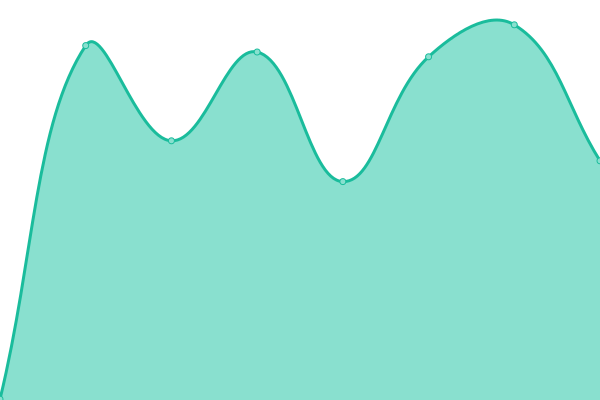

# [📈 Live Status](https://status.kitkat.zone): <!--live status--> **🟩 All systems operational**

This repository contains the open-source uptime monitor and status page for [KitKat Fund](https://kitkat.zone), powered by [Upptime](https://github.com/upptime/upptime).

With [Upptime](https://upptime.js.org), you can get your own unlimited and free uptime monitor and status page, powered entirely by a GitHub repository. We use [Issues](https://github.com/kitkatfund/kitkatfund.github.io/issues) as incident reports, [Actions](https://github.com/kitkatfund/kitkatfund.github.io/actions) as uptime monitors, and [Pages](https://status.kitkat.zone) for the status page.

<!--start: status pages-->
<!-- This summary is generated by Upptime (https://github.com/upptime/upptime) -->
<!-- Do not edit this manually, your changes will be overwritten -->
<!-- prettier-ignore -->
| URL | Status | History | Response Time | Uptime |
| --- | ------ | ------- | ------------- | ------ |
|  [KitKat](https://www.kitkat.zone) | 🟩 Up | [kit-kat.yml](https://github.com/kitkatfund/kitkatfund.github.io/commits/HEAD/history/kit-kat.yml) | 

 499ms
     
 | 

<a href="https://status.kitkat.zone/history/kit-kat">100.00%</a>
    

|  [KitKat Explorer](https://explorer.kitkat.zone) | 🟩 Up | [kit-kat-explorer.yml](https://github.com/kitkatfund/kitkatfund.github.io/commits/HEAD/history/kit-kat-explorer.yml) | 

 180ms
     
 | 

<a href="https://status.kitkat.zone/history/kit-kat-explorer">100.00%</a>
    

|  [KitKat Docs](https://docs.kitkat.zone) | 🟩 Up | [kit-kat-docs.yml](https://github.com/kitkatfund/kitkatfund.github.io/commits/HEAD/history/kit-kat-docs.yml) | 

 628ms
     
 | 

<a href="https://status.kitkat.zone/history/kit-kat-docs">100.00%</a>
    

|  [Archway API](https://archway-api.kitkat.zone/cosmos/auth/v1beta1/params) | 🟩 Up | [archway-api.yml](https://github.com/kitkatfund/kitkatfund.github.io/commits/HEAD/history/archway-api.yml) | 

 306ms
     
 | 

<a href="https://status.kitkat.zone/history/archway-api">100.00%</a>
    

|  [Archway RPC](https://archway-rpc.kitkat.zone) | 🟩 Up | [archway-rpc.yml](https://github.com/kitkatfund/kitkatfund.github.io/commits/HEAD/history/archway-rpc.yml) | 

 296ms
     
 | 

<a href="https://status.kitkat.zone/history/archway-rpc">100.00%</a>
    

|  [BitCanna API](https://bitcanna-api.kitkat.zone/cosmos/auth/v1beta1/params) | 🟩 Up | [bit-canna-api.yml](https://github.com/kitkatfund/kitkatfund.github.io/commits/HEAD/history/bit-canna-api.yml) | 

 379ms
     
 | 

<a href="https://status.kitkat.zone/history/bit-canna-api">76.27%</a>
    

|  [BitCanna RPC](https://bitcanna-rpc.kitkat.zone) | 🟩 Up | [bit-canna-rpc.yml](https://github.com/kitkatfund/kitkatfund.github.io/commits/HEAD/history/bit-canna-rpc.yml) | 

 364ms
     
 | 

<a href="https://status.kitkat.zone/history/bit-canna-rpc">76.27%</a>
    

|  [Omniflix API](https://omniflix-api.kitkat.zone/cosmos/auth/v1beta1/params) | 🟩 Up | [omniflix-api.yml](https://github.com/kitkatfund/kitkatfund.github.io/commits/HEAD/history/omniflix-api.yml) | 

 303ms
     
 | 

<a href="https://status.kitkat.zone/history/omniflix-api">100.00%</a>
    

|  [Omniflix RPC](https://omniflix-rpc.kitkat.zone) | 🟩 Up | [omniflix-rpc.yml](https://github.com/kitkatfund/kitkatfund.github.io/commits/HEAD/history/omniflix-rpc.yml) | 

 271ms
     
 | 

<a href="https://status.kitkat.zone/history/omniflix-rpc">100.00%</a>
    

|  [Quasar API](https://quasar-api.kitkat.zone/cosmos/auth/v1beta1/params) | 🟩 Up | [quasar-api.yml](https://github.com/kitkatfund/kitkatfund.github.io/commits/HEAD/history/quasar-api.yml) | 

 316ms
     
 | 

<a href="https://status.kitkat.zone/history/quasar-api">77.81%</a>
    

|  [Quasar RPC](https://quasar-rpc.kitkat.zone) | 🟩 Up | [quasar-rpc.yml](https://github.com/kitkatfund/kitkatfund.github.io/commits/HEAD/history/quasar-rpc.yml) | 

 318ms
     
 | 

<a href="https://status.kitkat.zone/history/quasar-rpc">77.81%</a>
    

|  [Quicksilver API](https://quicksilver-api.kitkat.zone/cosmos/auth/v1beta1/params) | 🟩 Up | [quicksilver-api.yml](https://github.com/kitkatfund/kitkatfund.github.io/commits/HEAD/history/quicksilver-api.yml) | 

 336ms
     
 | 

<a href="https://status.kitkat.zone/history/quicksilver-api">100.00%</a>
    

|  [Quicksilver RPC](https://quicksilver-rpc.kitkat.zone) | 🟩 Up | [quicksilver-rpc.yml](https://github.com/kitkatfund/kitkatfund.github.io/commits/HEAD/history/quicksilver-rpc.yml) | 

 364ms
     
 | 

<a href="https://status.kitkat.zone/history/quicksilver-rpc">100.00%</a>
    

<!--end: status pages-->

[**Visit our status website →**](https://status.kitkat.zone)

## 📄 License

- Powered by: [Upptime](https://github.com/upptime/upptime)
- Code: [MIT](./LICENSE) © [KitKat Fund](https://kitkat.zone)
- Data in the `./history` directory: [Open Database License](https://opendatacommons.org/licenses/odbl/1-0/)
