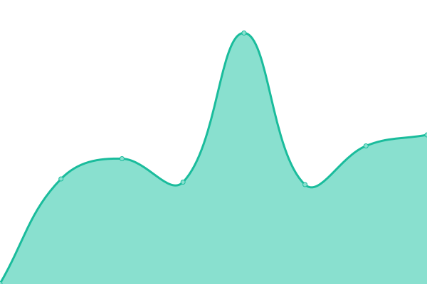

# [📈 Live Status](https://status.kitkat.zone): <!--live status--> **🟧 Partial outage**

This repository contains the open-source uptime monitor and status page for [KitKat Fund](https://kitkat.zone), powered by [Upptime](https://github.com/upptime/upptime).

With [Upptime](https://upptime.js.org), you can get your own unlimited and free uptime monitor and status page, powered entirely by a GitHub repository. We use [Issues](https://github.com/kitkatfund/kitkatfund.github.io/issues) as incident reports, [Actions](https://github.com/kitkatfund/kitkatfund.github.io/actions) as uptime monitors, and [Pages](https://status.kitkat.zone) for the status page.

<!--start: status pages-->
<!-- This summary is generated by Upptime (https://github.com/upptime/upptime) -->
<!-- Do not edit this manually, your changes will be overwritten -->
<!-- prettier-ignore -->
| URL | Status | History | Response Time | Uptime |
| --- | ------ | ------- | ------------- | ------ |
|  [KitKat](https://www.kitkat.zone) | 🟩 Up | [kit-kat.yml](https://github.com/kitkatfund/kitkatfund.github.io/commits/HEAD/history/kit-kat.yml) | 

 707ms
     
 | 

<a href="https://status.kitkat.zone/history/kit-kat">100.00%</a>
    

|  [KitKat Explorer](https://explorer.kitkat.zone) | 🟩 Up | [kit-kat-explorer.yml](https://github.com/kitkatfund/kitkatfund.github.io/commits/HEAD/history/kit-kat-explorer.yml) | 

 160ms
     
 | 

<a href="https://status.kitkat.zone/history/kit-kat-explorer">100.00%</a>
    

|  [KitKat Docs](https://docs.kitkat.zone) | 🟩 Up | [kit-kat-docs.yml](https://github.com/kitkatfund/kitkatfund.github.io/commits/HEAD/history/kit-kat-docs.yml) | 

 1324ms
     
 | 

<a href="https://status.kitkat.zone/history/kit-kat-docs">100.00%</a>
    

|  [BitCanna API](https://bitcanna-api.kitkat.zone/cosmos/auth/v1beta1/params) | 🟩 Up | [bit-canna-api.yml](https://github.com/kitkatfund/kitkatfund.github.io/commits/HEAD/history/bit-canna-api.yml) | 

 419ms
     
 | 

<a href="https://status.kitkat.zone/history/bit-canna-api">99.37%</a>
    

|  [BitCanna RPC](https://bitcanna-rpc.kitkat.zone) | 🟩 Up | [bit-canna-rpc.yml](https://github.com/kitkatfund/kitkatfund.github.io/commits/HEAD/history/bit-canna-rpc.yml) | 

 391ms
     
 | 

<a href="https://status.kitkat.zone/history/bit-canna-rpc">98.63%</a>
    

|  [Crescent API](https://crescent-api.kitkat.zone/cosmos/auth/v1beta1/params) | 🟥 Down | [crescent-api.yml](https://github.com/kitkatfund/kitkatfund.github.io/commits/HEAD/history/crescent-api.yml) | 

 347ms
     
 | 

<a href="https://status.kitkat.zone/history/crescent-api">53.75%</a>
    

|  [Crescent RPC](https://crescent-rpc.kitkat.zone) | 🟩 Up | [crescent-rpc.yml](https://github.com/kitkatfund/kitkatfund.github.io/commits/HEAD/history/crescent-rpc.yml) | 

 405ms
     
 | 

<a href="https://status.kitkat.zone/history/crescent-rpc">84.21%</a>
    

|  [Quasar API](https://quasar-api.kitkat.zone/cosmos/auth/v1beta1/params) | 🟩 Up | [quasar-api.yml](https://github.com/kitkatfund/kitkatfund.github.io/commits/HEAD/history/quasar-api.yml) | 

 376ms
     
 | 

<a href="https://status.kitkat.zone/history/quasar-api">97.94%</a>
    

|  [Quasar RPC](https://quasar-rpc.kitkat.zone) | 🟩 Up | [quasar-rpc.yml](https://github.com/kitkatfund/kitkatfund.github.io/commits/HEAD/history/quasar-rpc.yml) | 

 351ms
     
 | 

<a href="https://status.kitkat.zone/history/quasar-rpc">97.94%</a>
    

|  [Quicksilver API](https://quicksilver-api.kitkat.zone/cosmos/auth/v1beta1/params) | 🟩 Up | [quicksilver-api.yml](https://github.com/kitkatfund/kitkatfund.github.io/commits/HEAD/history/quicksilver-api.yml) | 

 721ms
     
 | 

<a href="https://status.kitkat.zone/history/quicksilver-api">60.07%</a>
    

|  [Quicksilver RPC](https://quicksilver-rpc.kitkat.zone) | 🟩 Up | [quicksilver-rpc.yml](https://github.com/kitkatfund/kitkatfund.github.io/commits/HEAD/history/quicksilver-rpc.yml) | 

 365ms
     
 | 

<a href="https://status.kitkat.zone/history/quicksilver-rpc">60.06%</a>
    

<!--end: status pages-->

[**Visit our status website →**](https://status.kitkat.zone)

## 📄 License

- Powered by: [Upptime](https://github.com/upptime/upptime)
- Code: [MIT](./LICENSE) © [KitKat Fund](https://kitkat.zone)
- Data in the `./history` directory: [Open Database License](https://opendatacommons.org/licenses/odbl/1-0/)
